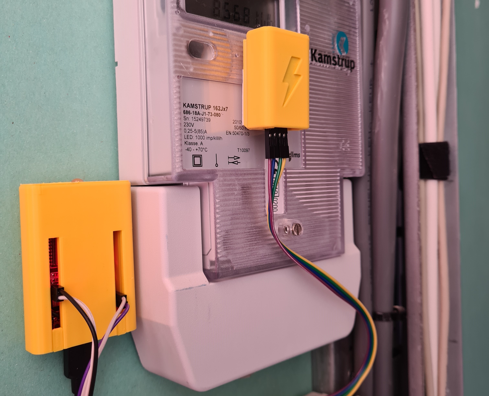

# Home Assistant Glow 🌟

<!-- PROJECT SHIELDS -->
![Project Maintenance][maintenance-shield]
[![License][license-shield]](LICENSE)
[![Forks][forks-shield]][forks-url]
[![Stargazers][stars-shield]][stars-url]
[![Issues][issues-shield]][issues-url]

[![GitHub Activity][commits-shield]][commits]
[![GitHub Last Commit][last-commit-shield]][commits]
[![Contributors][contributors-shield]][contributors-url]

During my internship at [Nabu Casa][nc] in the first half of 2021, I focused on energy management for your house, how to collect all energy data and display it on a dashboard. Since Home Assistant release **2021.8** it's possible to use the [Home Assistant Energy][energy] dashboard to display your energy usage. Unfortunately, not everyone has a smart meter and/or is equipped with a P1 port. This is where the Home Assistant Glow comes in!

  

  
CLICK HERE! To see the Home Assistant Glow in action.

  

    
  

Home Assistant Glow makes a *(not so)* smart meter without a P1 port easily readable, reading the pulse LED that is always present in most cases and it works with [ESPHome][esphome]! To neatly hide it all in your meter cupboard, a case has been designed that you can 3D print yourself.

### How do I know if my meter is supported?

To make sure your meter will work with the Home Assistant Glow, you have to look for the `imp/kWh` rate on your meter (see picture). Make a note of this value because you may need it later when configuring your device.

  

## Get Started

On the [documentation website](https://glow-energy.io/docs/introduction) you will find a complete walkthrough with which hardware you need, how to install the correct firmware on your ESP (using esp web tools) and how to add it to Home Assistant.

## Hardware

First, fill your 🛒 or see if you already have the components below.

- One of the micro controllers
  - ESP32 (recommended) - [Banggood][esp32-bg-shop] or [AliExpress][esp32-ali-shop]
  - ESP8266 - [Banggood][esp8266-bg-shop] or [AliExpress][esp8266-ali-shop]
  - Wemos D1 mini - [Banggood][wemos-d1-bg-shop] or [AliExpress][wemos-d1-ali-shop]
- [Dupont Jumpers][dupont-jumpers-shop]
- 3D printed case (see the [case](https://glow-energy.io/docs/reference/cases) folder)
- LM393 Photodiode: [Banggood][photodiode-bg-shop] or [AliExpress][photodiode-ali-shop] (make sure that you do not accidentally order or receive an LDR)
- LED RGB 5mm 4 pin - kathode: [Banggood][rgbled-bg-shop] or [AliExpress][rgbled-ali-shop]

## Contributing

This is an active open-source project. We are always open to people who want to use the code or contribute to it.

We've set up a separate document for our
[contribution guidelines](CONTRIBUTING.md).

Thank you for being involved! :heart_eyes:

## Disclamer

We use AliExpress / Banggood affiliate links for the components and the tools. Some Ad-blockers might block these links an thus they seem to appear broken. You will have to temporarily disable ad-blocker to open these links.

## License

MIT License

Copyright (c) 2021-2024 Klaas Schoute

Permission is hereby granted, free of charge, to any person obtaining a copy
of this software and associated documentation files (the "Software"), to deal
in the Software without restriction, including without limitation the rights
to use, copy, modify, merge, publish, distribute, sublicense, and/or sell
copies of the Software, and to permit persons to whom the Software is
furnished to do so, subject to the following conditions:

The above copyright notice and this permission notice shall be included in all
copies or substantial portions of the Software.

THE SOFTWARE IS PROVIDED "AS IS", WITHOUT WARRANTY OF ANY KIND, EXPRESS OR
IMPLIED, INCLUDING BUT NOT LIMITED TO THE WARRANTIES OF MERCHANTABILITY,
FITNESS FOR A PARTICULAR PURPOSE AND NONINFRINGEMENT. IN NO EVENT SHALL THE
AUTHORS OR COPYRIGHT HOLDERS BE LIABLE FOR ANY CLAIM, DAMAGES OR OTHER
LIABILITY, WHETHER IN AN ACTION OF CONTRACT, TORT OR OTHERWISE, ARISING FROM,
OUT OF OR IN CONNECTION WITH THE SOFTWARE OR THE USE OR OTHER DEALINGS IN THE
SOFTWARE.

<!-- MARKDOWN LINKS & IMAGES -->
[esphome]: https://esphome.io
[nc]: https://www.nabucasa.com
[energy]: https://www.home-assistant.io/home-energy-management

<!-- Shields -->
[maintenance-shield]: https://img.shields.io/maintenance/yes/2024.svg
[contributors-shield]: https://img.shields.io/github/contributors/klaasnicolaas/home-assistant-glow.svg
[contributors-url]: https://github.com/klaasnicolaas/home-assistant-glow/graphs/contributors
[forks-shield]: https://img.shields.io/github/forks/klaasnicolaas/home-assistant-glow.svg
[forks-url]: https://github.com/klaasnicolaas/home-assistant-glow/network/members
[stars-shield]: https://img.shields.io/github/stars/klaasnicolaas/home-assistant-glow.svg
[stars-url]: https://github.com/klaasnicolaas/home-assistant-glow/stargazers
[issues-shield]: https://img.shields.io/github/issues/klaasnicolaas/home-assistant-glow.svg
[issues-url]: https://github.com/klaasnicolaas/home-assistant-glow/issues
[license-shield]: https://img.shields.io/github/license/klaasnicolaas/home-assistant-glow.svg
[commits-shield]: https://img.shields.io/github/commit-activity/y/klaasnicolaas/home-assistant-glow.svg
[commits]: https://github.com/klaasnicolaas/home-assistant-glow/commits/main
[last-commit-shield]: https://img.shields.io/github/last-commit/klaasnicolaas/home-assistant-glow.svg

<!-- Hardware -->
[esp32-bg-shop]: https://www.banggood.com/bang/?tt=16956_12_417111_&r=https%3A%2F%2Fnl.banggood.com%2FGeekcreit-ESP32-WiFi%2Bbluetooth-Development-Board-Ultra-Low-Power-Consumption-Dual-Cores-Pins-Unsoldered-p-1214159.html
[esp32-ali-shop]: https://tc.tradetracker.net/?c=15640&m=12&a=417111&r=&u=https%3A%2F%2Faliexpress.com%2Fitem%2F1005005970816555.html
[esp8266-bg-shop]: https://www.banggood.com/bang/?tt=16956_12_417111_&r=%2Fnl%2FGeekcreit-NodeMcu-Lua-ESP8266-ESP-12F-WIFI-Development-Board-p-985891.html
[esp8266-ali-shop]: https://tc.tradetracker.net/?c=15640&m=12&a=417111&r=&u=https%3A%2F%2Faliexpress.com%2Fitem%2F1005005977505151.html
[wemos-d1-bg-shop]: https://www.banggood.com/bang/?tt=16956_12_417111_&r=%2Fnl%2FGeekcreit-D1-Mini-V3_0_0-WIFI-Internet-Of-Things-Development-Board-Based-ESP8266-4MB-MicroPython-Nodemcu-p-1264245.html
[wemos-d1-ali-shop]: https://tc.tradetracker.net/?c=15640&m=12&a=417111&r=&u=https%3A%2F%2Faliexpress.com%2Fitem%2F1005006018009983.html
[dupont-jumpers-shop]: https://www.banggood.com/bang/?tt=16956_12_417111_&r=https%3A%2F%2Fnl.banggood.com%2F120pcs-20cm-Male-To-Female-Female-To-Female-Male-To-Male-Color-Breadboard-Jumper-Cable-Dupont-Wire-p-974006.html
[photodiode-bg-shop]: https://www.banggood.com/bang/?tt=16956_12_417111_&r=https%3A%2F%2Fnl.banggood.com%2F4Pin-Photodiode-Sensor-Controller-Module-Measure-Module-p-1416445.html
[photodiode-ali-shop]: https://tc.tradetracker.net/?c=15640&m=12&a=417111&r=&u=https%3A%2F%2Faliexpress.com%2Fitem%2F1005003302215339.html
[rgbled-bg-shop]: https://www.banggood.com/bang/?tt=16956_12_417111_&r=https%3A%2F%2Fnl.banggood.com%2F50pcs-LED-RGB-Common-Cathode-4-Pin-F5-5MM-Diode-p-1016398.html
[rgbled-ali-shop]: https://tc.tradetracker.net/?c=15640&m=12&a=417111&r=&u=%2Fitem%2F4000225253691.html