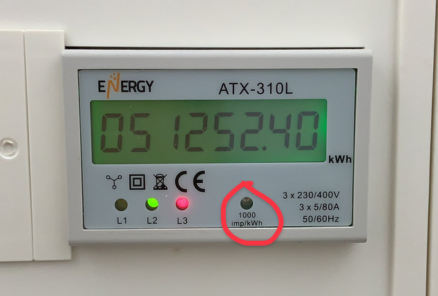
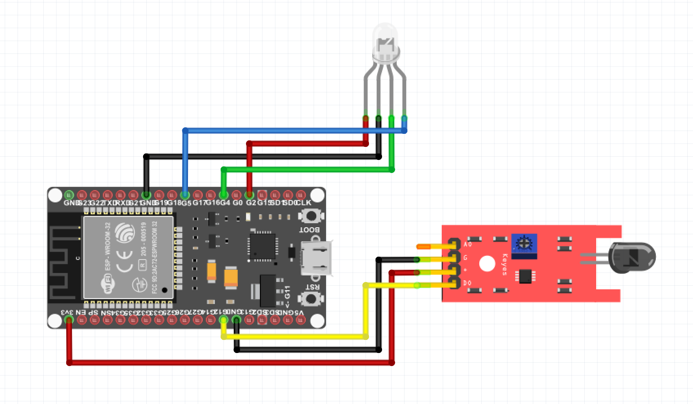
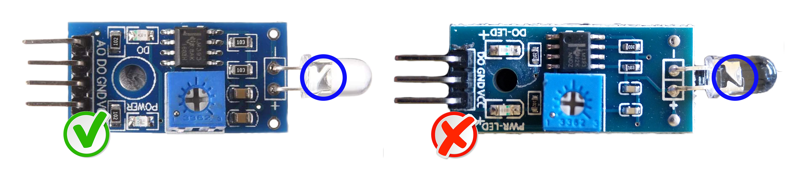

# Home Assistant Glow 🌟

<!-- PROJECT SHIELDS -->
![Project Maintenance][maintenance-shield]
[![License][license-shield]](LICENSE)
[![Forks][forks-shield]][forks-url]
[![Stargazers][stars-shield]][stars-url]
[![Issues][issues-shield]][issues-url]

[![GitHub Activity][commits-shield]][commits]
[![GitHub Last Commit][last-commit-shield]][commits]
[![Contributors][contributors-shield]][contributors-url]

During my internship at [Nabu Casa][nc] in the first half of 2021, I focused on energy management in homes and how to collect all energy data and display it on a dashboard. From core release **2021.8** you can now also get started with the [energy dashboard][energy] in Home Assistant!

<p align="center">
  
</p>

<details>
  <summary>CLICK HERE! To see the Home Assistant Glow in action.</summary>

  <p align="center">
    
  </p>
</details>

Home Assistant Glow makes a *(not so)* smart meter without a P1 port easily readable, reading the pulse LED that is always present in most cases and it works with [ESPHome][esphome]! To neatly hide it all in your meter cupboard, a case has been designed that you can 3D print yourself.

### How do I know if my meter is supported?

To make sure your meter will work with the Home Assistant Glow, you have to look for the **imp/kWh** rate (see picture). Note the value, because it will be of importance at a later stage to configure the `home_assistant_glow.yaml` file.

<p align="center">
  
</p>

## Hardware

First, fill your 🛒 or see if you already have the components below.

- One of these microcontrollers
  - ESP32 (recommended) - [Banggood][esp32-bg-shop] or [AliExpress][esp32-ali-shop]
  - ESP8266 - [Banggood][esp8266-bg-shop] or [AliExpress][esp8266-ali-shop]
  - Wemos D1 - [Banggood][wemos-d1-bg-shop] or [AliExpress][wemos-d1-ali-shop]
- [Dupont Jumpers][dupont-jumpers-shop]
- 3D printed case (see the [case](/case) folder)
- Photodiode: [Banggood][photodiode-bg-shop] or [AliExpress][photodiode-ali-shop] (make sure that you do not accidentally order or receive an LDR)
- LED RGB 5mm 4 pin - kathode: [Banggood][rgbled-bg-shop] or [AliExpress][rgbled-ali-shop]

### Visual schema

Below you will find a visual schema of how everything is connected, depending on the type of board you use, the GPIO pins may be in a different place.

<p align="center">
  
</p>

### Diagrams

In the tables below you will find more information, about how to connect the photodiode PCB and the status LED.

#### Photodiode

How the photodiode is connected to the ESP board of your choice.

| PHOTODIODE | ESP32        | Wemos D1 / ESP8266 |
|------------|--------------|--------------------|
| A0         | NOT USING    | NOT USING          |
| DO         | D13 (GPIO13) | D7 (GPIO13)        |
| VCC        | 3V3          | 3V3                |
| GND        | GND          | GND                |

For problems with the measurements, see the [FAQ part](#faq) further down.

#### Status LED

How the status LED is connected to the ESP board of your choice. For each measured pulse, the LED will briefly flash <span style="color:red">*red*</span> and in case of no WiFi connection, the LED will continue to flash <span style="color:blue">*blue*</span>.

| LED    | ESP32      | D1 mini / ESP8266 |
|--------|------------|-------------------|
| RED    | D2 (GPIO2) | D4 (GPIO2)        |
| GREEN  | D4 (GPIO4) | D2 (GPIO4)        |
| BLUE   | D5 (GPIO5) | D1 (GPIO5)        |
| GND    | GND        | GND               |

### 3D printed case

You can use the [3D printed case](/case) to neatly hide everything, but it is specifically made for the ESP32S. If you use another board, you could adjust the design with the `.step` file. If you've made some changes, I'd appreciate it if you add the new case design to the repository for everyone to benefit 😉

## Get started

Once you are done connecting all the hardware, we'll get started with the configuration for ESPHome. In this repository you will find the file [home_assistant_glow.yaml][file], which you can copy into the `esphome` folder of your Home Assistant config.

### Configuration

After you go through the installation wizard of ESPHome and flash your ESP32/8266, you need to change the `pulse rate` to match with your meter ([how do I find my imp/kWh rate?](#how-do-i-know-if-my-meter-is-supported)). You can do this in 2 ways:

- Open the webserver of the Glow and change the value under `Pulse rate - imp/kWh`.
- Navigate to the device in Home Assistant and edit the number entity: `Pulse rate - imp/kWh`.

The default is **1000** and you can change it with steps of 100, between 100 and 10.000 (if your pulse rate falls outside the steps or value range, open an issue).

## FAQ

Anwers to some of the most frequently asked questions:

### Wrong soldered diode

Issue: [#34][issue_34]

A number of users have reported receiving the recommended diode board from various sources, only to find the diode has been soldered to the board the wrong way round. This can cause that your pulse LED is not measured regardless of the sensitivity you set for the diode.

<p align="center">
  
</p>

The large triangular part of the diode, should be soldered to the positive side of the board not the negative. If yours is orientated as above, you should desolder the photodiode invert it and resolder so the larger triangular part of the diode is connected to positive.

### Reduce the amount of data the sensors produce

Depending on the configured `pulse rate`, the type of house/apartment and the heating system in use, the sensors that are exposed to Home Assistant may produce a lot of data. For example, with the default `pulse rate` 1000, a power consumption of 3600 W means that the sensors produce 2 HA state changes per second (which means 7200 state changes per hour). If you don't need that kind of granularity, you can use [ESPHome sensor filters](https://esphome.io/components/sensor/index.html#sensor-filters) to reduce the rate of updates written to Home Assistant. With the commented-out filters in the [home_assistant_glow.yaml][file] enabled, only 396 state changes will be produced per hour.

### My Daily Energy won't reset

Issue: [#140][issue_140]

By default, the Home Assistant Glow uses the `homeassistant` [time platform][time-platform], which synchronizes the current time via the native API from your home assistant config. If this doesn't work, you could consider using the `sntp` time platform, as in the example below:

```yaml
time:
  - platform: sntp
    id: sntp_time
```

### Error 4 / Out of memory

Issue: [#240][issue_240]

With this error there is a chance that the instance your ESPHome is running on may be out of memory (possibly on a Raspberry Pi with less RAM), you can solve this by limiting the number of processes at compiling time using [compile_process_limit][compile_process_limit].

```yaml
esphome:
  compile_process_limit: 1
```

## Contributing

This is an active open-source project. We are always open to people who want to
use the code or contribute to it.

We've set up a separate document for our
[contribution guidelines](CONTRIBUTING.md).

Thank you for being involved! :heart_eyes:

## Disclamer

We use aliexpress / banggood affiliate links for the components and the tools. Some Ad-blockers might block these links an thus they seem to appear broken. You will have to temporarely disable ad-blocker to open these links.

## License

MIT License

Copyright (c) 2021-2023 Klaas Schoute

Permission is hereby granted, free of charge, to any person obtaining a copy
of this software and associated documentation files (the "Software"), to deal
in the Software without restriction, including without limitation the rights
to use, copy, modify, merge, publish, distribute, sublicense, and/or sell
copies of the Software, and to permit persons to whom the Software is
furnished to do so, subject to the following conditions:

The above copyright notice and this permission notice shall be included in all
copies or substantial portions of the Software.

THE SOFTWARE IS PROVIDED "AS IS", WITHOUT WARRANTY OF ANY KIND, EXPRESS OR
IMPLIED, INCLUDING BUT NOT LIMITED TO THE WARRANTIES OF MERCHANTABILITY,
FITNESS FOR A PARTICULAR PURPOSE AND NONINFRINGEMENT. IN NO EVENT SHALL THE
AUTHORS OR COPYRIGHT HOLDERS BE LIABLE FOR ANY CLAIM, DAMAGES OR OTHER
LIABILITY, WHETHER IN AN ACTION OF CONTRACT, TORT OR OTHERWISE, ARISING FROM,
OUT OF OR IN CONNECTION WITH THE SOFTWARE OR THE USE OR OTHER DEALINGS IN THE
SOFTWARE.

<!-- MARKDOWN LINKS & IMAGES -->
[file]: /home_assistant_glow.yaml
[esphome]: https://esphome.io
[nc]: https://www.nabucasa.com
[energy]: https://home-assistant.io/docs/energy/
[issue_34]: https://github.com/klaasnicolaas/home-assistant-glow/issues/34
[issue_140]: https://github.com/klaasnicolaas/home-assistant-glow/issues/140
[issue_240]: https://github.com/klaasnicolaas/home-assistant-glow/issues/240
[time-platform]: https://esphome.io/components/time.html#home-assistant-time-source
[compile_process_limit]: https://esphome.io/components/esphome.html?highlight=compile_process_limit

<!-- Shields -->
[maintenance-shield]: https://img.shields.io/maintenance/yes/2023.svg
[contributors-shield]: https://img.shields.io/github/contributors/klaasnicolaas/home-assistant-glow.svg
[contributors-url]: https://github.com/klaasnicolaas/home-assistant-glow/graphs/contributors
[forks-shield]: https://img.shields.io/github/forks/klaasnicolaas/home-assistant-glow.svg
[forks-url]: https://github.com/klaasnicolaas/home-assistant-glow/network/members
[stars-shield]: https://img.shields.io/github/stars/klaasnicolaas/home-assistant-glow.svg
[stars-url]: https://github.com/klaasnicolaas/home-assistant-glow/stargazers
[issues-shield]: https://img.shields.io/github/issues/klaasnicolaas/home-assistant-glow.svg
[issues-url]: https://github.com/klaasnicolaas/home-assistant-glow/issues
[license-shield]: https://img.shields.io/github/license/klaasnicolaas/home-assistant-glow.svg
[commits-shield]: https://img.shields.io/github/commit-activity/y/klaasnicolaas/home-assistant-glow.svg
[commits]: https://github.com/klaasnicolaas/home-assistant-glow/commits/main
[last-commit-shield]: https://img.shields.io/github/last-commit/klaasnicolaas/home-assistant-glow.svg

<!-- Hardware -->
[esp32-bg-shop]: https://www.banggood.com/bang/?tt=16956_12_417111_&r=https%3A%2F%2Fnl.banggood.com%2FGeekcreit-ESP32-WiFi%2Bbluetooth-Development-Board-Ultra-Low-Power-Consumption-Dual-Cores-Pins-Unsoldered-p-1214159.html
[esp32-ali-shop]: https://tc.tradetracker.net/?c=15640&m=12&a=417111&r=&u=%2Fitem%2F1005001929935550.html
[esp8266-bg-shop]: https://www.banggood.com/bang/?tt=16956_12_417111_&r=%2Fnl%2FGeekcreit-NodeMcu-Lua-ESP8266-ESP-12F-WIFI-Development-Board-p-985891.html
[esp8266-ali-shop]: https://tc.tradetracker.net/?c=15640&m=12&a=417111&r=&u=%2Fitem%2F4000160133215.html
[wemos-d1-bg-shop]: https://www.banggood.com/bang/?tt=16956_12_417111_&r=%2Fnl%2FGeekcreit-D1-Mini-V3_0_0-WIFI-Internet-Of-Things-Development-Board-Based-ESP8266-4MB-MicroPython-Nodemcu-p-1264245.html
[wemos-d1-ali-shop]: https://tc.tradetracker.net/?c=15640&m=12&a=417111&r=&u=%2Fitem%2F1005001621784437.html
[dupont-jumpers-shop]: https://www.banggood.com/bang/?tt=16956_12_417111_&r=https%3A%2F%2Fnl.banggood.com%2F120pcs-20cm-Male-To-Female-Female-To-Female-Male-To-Male-Color-Breadboard-Jumper-Cable-Dupont-Wire-p-974006.html
[photodiode-bg-shop]: https://www.banggood.com/bang/?tt=16956_12_417111_&r=https%3A%2F%2Fnl.banggood.com%2F4Pin-Photodiode-Sensor-Controller-Module-Measure-Module-p-1416445.html
[photodiode-ali-shop]: https://tc.tradetracker.net/?c=15640&m=12&a=417111&r=&u=%2Fitem%2F1005001640685908.html
[rgbled-bg-shop]: https://www.banggood.com/bang/?tt=16956_12_417111_&r=https%3A%2F%2Fnl.banggood.com%2F50pcs-LED-RGB-Common-Cathode-4-Pin-F5-5MM-Diode-p-1016398.html
[rgbled-ali-shop]: https://tc.tradetracker.net/?c=15640&m=12&a=417111&r=&u=%2Fitem%2F4000225253691.html