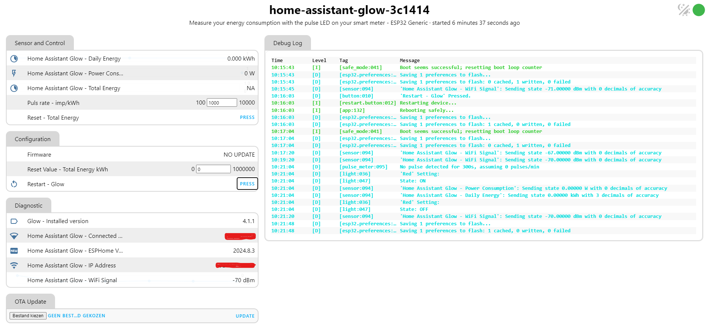

I'm excited to announce the release of version 4.2.0 of the Home Assistant Glow 🌟. It's a small release this time, built on the latest version of ESPHome (2024.8.x) and contains mostly dependency updates for Docusaurus.

<!-- truncate -->

## Moved to Web Server layout V3

The Home Assistant Glow has been upgraded to version 3 of the [web server][webserver] component. This latest version features a fresh design that is more user-friendly and responsive. You can now double-click on tabs to enlarge them, and the layout is optimized for a better mobile experience.



:::note
If you don't like the new layout, you can override the web server version in your configuration by using [!extend]. For example, to use the old layout, you can use the following configuration:

```yaml title="your_glow_config.yaml"
web_server:
  - id: !extend esphome_web_server
    version: 2
```
:::

## Wrap up

If you would like to support the project, you can do so through [GitHub sponsors](https://github.com/sponsors/klaasnicolaas) or Ko-fi. If you have any questions, you can ask them via the [discussions](https://github.com/klaasnicolaas/home-assistant-glow/discussions), and if you encounter problems with the Home Assistant Glow, you can indicate this in the [issues](https://github.com/klaasnicolaas/home-assistant-glow/issues).

./Klaas

[](https://ko-fi.com/F1F1SW69D)

## Related links

- [ESPHome 2024.8.x - Changelog][esphome-changelog]
- [ESPHome - Extend][!extend]
- [Customizing the firmware](/docs/advanced/firmware_customization)

<!-- Links -->
[esphome-changelog]: https://esphome.io/changelog/2024.8.0.html
[webserver]: https://esphome.io/components/web_server.html
[!extend]: https://esphome.io/components/packages.html#extend
