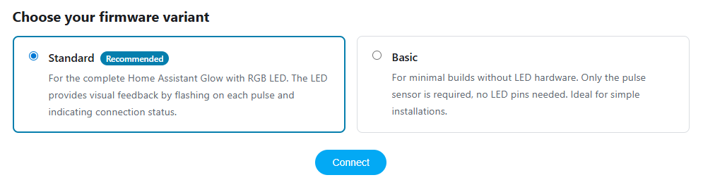
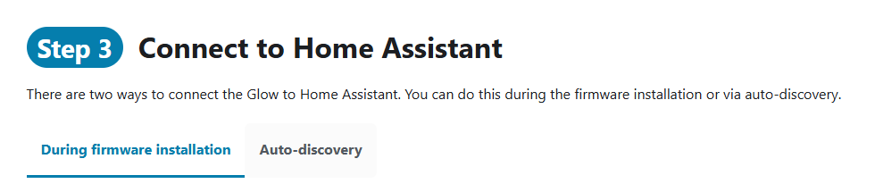

Version 4.4.0 of the Home Assistant Glow is here 🌟! The highlight of this release is the **Glow Basic** variant, a firmware for setups without LED hardware, alongside improved GitHub Actions workflows and a refreshed documentation experience.

<!-- truncate -->

## Glow Basic Variant

Based on a [community request][discussion-910], this release introduces **Glow Basic**: a firmware variant without LED support. For setups where the Glow sits in a closed meter cabinet or where the LED hardware simply isn't wired up, there was no clean way to run the firmware without unnecessary LED-related log entries. Glow Basic solves that.

- **Lighter firmware**: No LED components are included, resulting in a smaller and simpler build
- **Separate device identity**: Shows up as `Glow Basic` in Home Assistant, making it easy to distinguish from the standard variant
- **Same core functionality**: Pulse meter, energy tracking, OTA updates, and web server all work the same

Available for all three supported boards: ESP32, ESP32-C3, and ESP8266.

### Choosing Your Variant

The [Getting Started](/docs/getting-started) page now features an interactive firmware selector to pick between **Standard** and **Basic** before flashing your device.

## Improved Build & Deploy Workflows

The GitHub Actions workflows have been updated to support both firmware variants through a matrix build strategy:

- **Matrix builds**: Each pull request and release now builds firmware for all device and variant combinations in parallel
- **Organized artifacts**: Build artifacts follow a clear naming scheme (`build-glow-standard-esp32`, `build-glow-basic-esp32c3`, etc.)
- **PR download table**: Pull request comments now include a table with download links for both variants, making it easy to test firmware from any PR

## Documentation Improvements

The getting started guide received a visual overhaul:

- **Step badges**: Each step now has a numbered badge for clearer visual guidance
- **Firmware selector component**: An interactive radio button card to choose between Standard and Basic before connecting
- **Tabbed connection options**: Step 3 now uses tabs to present the different connection methods (auto-discovery vs manual configuration)

## Upgrading to 4.4.0

There are several ways to update your Glow to the latest version:

- **Via Home Assistant**: If your Glow is connected to Home Assistant, you'll receive an update notification automatically. Simply click update from the device page — the easiest option.
- **Via the Web Interface (OTA)**: Download the correct firmware binary from the [Firmware Updates](/docs/advanced/firmware_updates) page, open the Glow's web interface, and upload it via the **OTA Update** section.
- **Via USB**: Head to the [Getting Started](/docs/getting-started) page, select your variant, and flash via USB.

:::tip Switching variants
You can switch from Standard to Basic (or vice versa) by simply flashing the other variant. Your Wi-Fi credentials and Home Assistant connection will be preserved.
:::

## Wrap up

This release makes the Home Assistant Glow more accessible by offering a basic variant for builds without LED hardware, while improving the development workflow and documentation along the way.

If you would like to support the project, you can do so through [GitHub sponsors](https://github.com/sponsors/klaasnicolaas) or Ko-fi. If you have any questions, you can ask them via the [discussions](https://github.com/klaasnicolaas/home-assistant-glow/discussions), and if you encounter problems with the Home Assistant Glow, you can indicate this in the [issues](https://github.com/klaasnicolaas/home-assistant-glow/issues).

./Klaas

## Related links

- [Getting Started Guide](/docs/getting-started)
- [Firmware Updates](/docs/advanced/firmware_updates)
- [Customizing the Firmware](/docs/advanced/firmware_changes)

<!-- Links -->
[discussion-910]: https://github.com/klaasnicolaas/home-assistant-glow/discussions/910