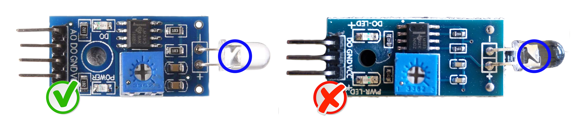

Linked issue: [#34](https://github.com/klaasnicolaas/home-assistant-glow/issues/34)

A number of users have reported receiving the recommended diode board from various sources, only to find the diode has been soldered to the board the wrong way round. This can cause that your pulse LED is not measured regardless of the sensitivity you set for the diode.

The large triangular part of the diode, should be soldered to the positive side of the board not the negative. If yours is orientated as above, you should desolder the photodiode invert it and resolder so the larger triangular part of the diode is connected to positive.