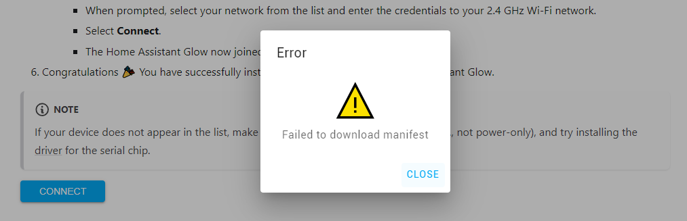

Linked issue: [#358][issue_358]

This error can occur if you try to install Home Assistant Glow on an ESP for which the correct firmware build is not available and is therefore missing from the manifest file. There are many variations in circulation, especially with the [ESP32][ESP32] and [ESP8266][ESP8266], and it is sometimes difficult to find out exactly which board a seller is selling (based on pictures).

## What to do?

If you encounter the above problem, please create an [issue](https://github.com/klaasnicolaas/home-assistant-glow/issues), include photos of your board and possibly a link to the shop where you bought it. This allows me to check if it's missing and consider adding a new firmware build to the repository.

### Advanced debugging

If you are an advanced user you could copy the complete yaml config to your own esphome environment, investigate exactly which board type you need and let me know.

[issue_358]: https://github.com/klaasnicolaas/home-assistant-glow/issues/358
[ESP32]: https://registry.platformio.org/platforms/platformio/espressif32/boards
[ESP8266]: https://registry.platformio.org/platforms/platformio/espressif8266/boards