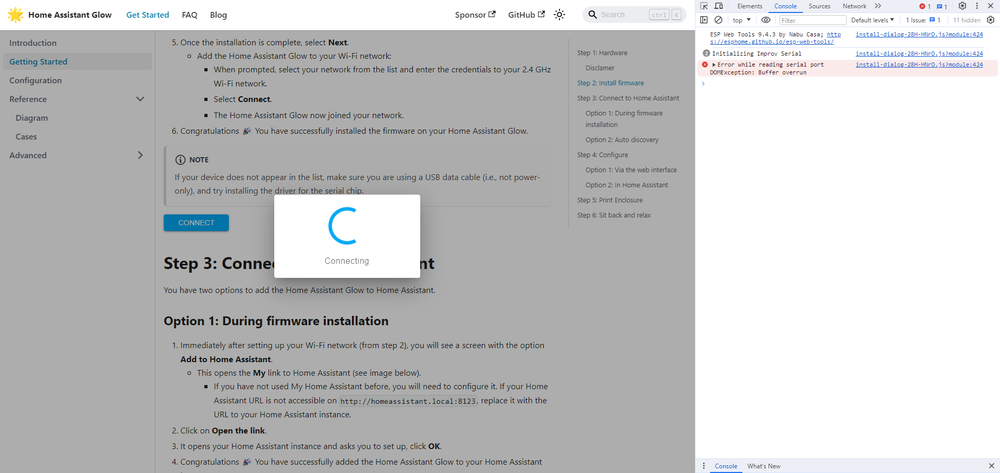

This error can occur during the installation process and is usually caused by a bad connection between the ESP and the computer. This can be caused by a bad USB cable, a bad USB port or a bad connection on the ESP itself. If you open developer tools in your browser (F12) and go to the console tab, you may see the following error:

```text
Error while reading serial port DOMException: Buffer overrun
```

## What to do?

Reconnect the cable to the ESP and try the installation process again, you could also try a different cable.