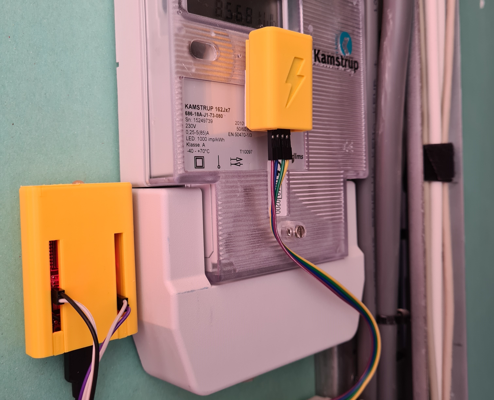

[![GitHub Sponsors][sponsor-shield]][sponsor-url]

[![GitHub release][release-shield]][release-url]
[![Stargazers][stars-shield]][stars-url]
[![GitHub Last Commit][last-commit-shield]][commits-url]

# Home Assistant Glow

  

Home Assistant Glow makes a *(not so)* smart meter without a P1 port easily readable, reading the pulse LED that is always present in most cases and it works with [ESPHome][esphome]! To neatly hide it all in your meter cupboard, a case has been designed that you can 3D print yourself.

## Installation

You can use the button below to install the home assistant glow firmware directly to your device via USB from the browser.

<esp-web-install-button manifest="./manifest.json"></esp-web-install-button>

[esphome]: https://esphome.io/

[release-shield]: https://img.shields.io/github/release/klaasnicolaas/home-assistant-glow.svg
[release-url]: https://GitHub.com/klaasnicolaas/home-assistant-glow/releases/
[stars-shield]: https://img.shields.io/github/stars/klaasnicolaas/home-assistant-glow.svg
[stars-url]: https://github.com/klaasnicolaas/home-assistant-glow/stargazers
[last-commit-shield]: https://img.shields.io/github/last-commit/klaasnicolaas/home-assistant-glow.svg
[commits-url]: https://github.com/klaasnicolaas/home-assistant-glow/commits/main
[sponsor-shield]: https://img.shields.io/github/sponsors/klaasnicolaas?label=Sponsor%20this%20project&style=for-the-badge
[sponsor-url]: https://github.com/sponsors/klaasnicolaas